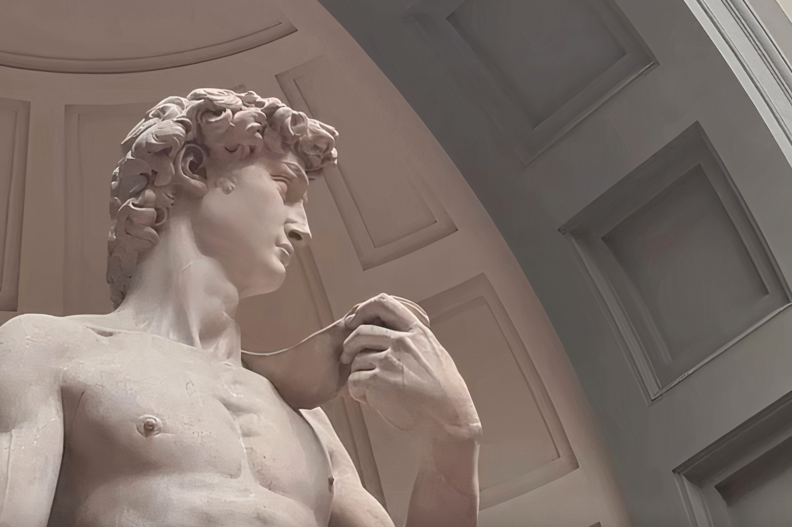

### Hi there :3
- 🦢 I am currently pursuing a Master of Science (M.S.I.E.) in Industrial Engineering at Purdue University, with a focus in Human Factors and Ergonomics. I am passionate about design, systems, and how our environment affects the human experience.
- 🦆 I also completed my undergraduate at Purdue University, holding a Bachelor of Science (B.S.) in Product Design, with minors in Psychological Science and Innovation & Transformational Change! I specialized in human-centered design and aesthetics.
- 👷‍♂️ I am currently a Mechanical Design Engineer at General Electric where I work with large-scale power and energy infrastructure, electromechanical components, and modeling the grid!
- 🛰️ I am a previous intern at Ball Aerospace, my work focused on knowledge and intelligence management for mission systems, including continuous improvement methods, model-based systems engineering, and user-interfaces!
- 🏗️ I am a previous structural engineering researcher at Bowen Laboratory, studying steel concrete composite structures under destructive blast conditions!
- 🏔 I have also previously done contract work or internships with AES Corporation, Northrop Grumman, PepsiCo, and Purdue Unviersity
- 🌱 I am interested in drawing, tennis, writing, hiking, and music!  

 

- 🌙 My portfolio is https://masoncknight.com and my LinkedIn is https://www.linkedin.com/in/mason-knight-5168b61bb/
- 🖥️ I have VERY general knowledge in the following languages: Java, Python, Matlab, C, C++, HTML, CSS, JS, VBA  
<!--
**masonknight22/masonknight22** is a ✨ _special_ ✨ repository because its `README.md` (this file) appears on your GitHub profile.

Here are some ideas to get you started:

- 🔭 I’m currently working on a Bachelor of Science (B.S.) in Industrial Design. 
- 🌱 I’m currently learning human-centered design and Engineering
- 👯 I’m looking to collaborate on anything!
- 🤔 I’m looking for help with learning new coding languages :3 I am open to learning more  
- 💬 Ask me about my work, I have a portfolio at https://www.masoncknight.com
- 📫 How to reach me: knigh112@purdue.edu and (765) 209-2851 
- 😄 Pronouns: He/Him
- ⚡ Fun fact: My sister and I are completely ambidextrous! We got this from our Mimi who was a wonderful artist <3
--> 
