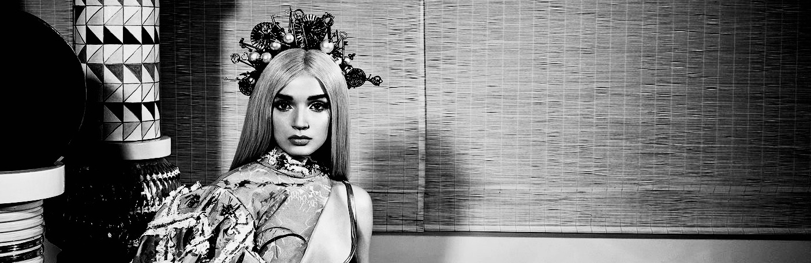

### Hi there :3
- 🦆 I am a student at Purdue University studying towards a Bachelor of Science (B.S.) in Design with minors in Psychological Science, Computer Science, Transformational Engineering and Management!
- 🏗️ I am currently a structural engineering researcher at Bowen Laboratory, studying steel concrete composite structures under destructive blast conditions!
- 🌱 I am interested in drawing, design, and tennis. My favorite entertainer Poppy, pictured below, is someone whom I get a lot of inspiration from!

- 🌙 My portfolio is https://masoncknight.com and my LinkedIn is https://www.linkedin.com/in/mason-knight-5168b61bb/
<!--
**masonknight22/masonknight22** is a ✨ _special_ ✨ repository because its `README.md` (this file) appears on your GitHub profile.

Here are some ideas to get you started:

- 🔭 I’m currently working on a Bachelor of Science (B.S.) in Computer Graphics Technology (User Experience Design) with plans to go to graduate school.
- 🌱 I’m currently learning human-centered design and Engineering
- 👯 I’m looking to collaborate on anything!
- 🤔 I’m looking for help with learning new coding languages :3 I am open to learning more  
- 💬 Ask me about my work, I have a portfolio at https://www.masoncknight.com
- 📫 How to reach me: knigh112@purdue.edu and (765) 209-2851
- 😄 Pronouns: He/Him
- ⚡ Fun fact: My sister and I are completely ambidextrous! We got this from our Mimi who was a wonderful artist <3
-->
